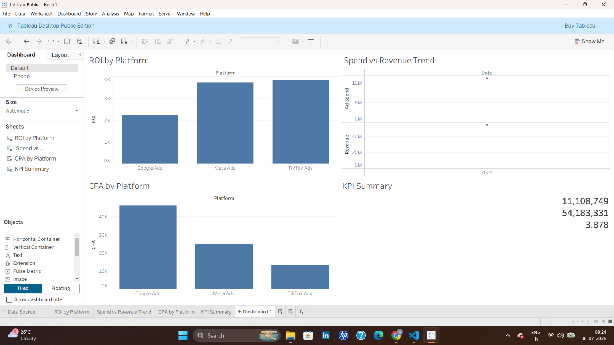

# 📊 Marketing Campaign ROI Analysis

Analyzing multi-platform ad campaign performance to uncover where marketing budget delivers the best return.

---

## 🧩 Overview

This project evaluates advertising performance across **Google Ads, Meta Ads, and TikTok Ads** to identify which platforms drive the most profitable returns. Using Excel for data cleaning and metric calculation, and Tableau for visualization, the analysis translates raw campaign data into clear, actionable insights for budget allocation.

---

## ❓ Business Problem

> Which marketing platforms are generating the best ROI, and where should ad spend be reallocated to maximize returns?

---

## 🗂️ Dataset

- **Source:** [Global Ads Performance (Google, Meta, TikTok) — Kaggle](https://www.kaggle.com/datasets/nudratabbas/global-ads-performance-google-meta-tiktok)
- **Contents:** Campaign-level data including impressions, clicks, spend, conversions, revenue, CTR, CPC, CPA, and ROAS across platforms, industries, and countries.

---

## 🛠️ Tools Used

- **Excel** — Data cleaning, formula-based metrics (ROI), Pivot Tables
- **Tableau Public** — Interactive dashboard & visualization

---

## 🔍 Key Insights

- 🚀 **TikTok Ads and Meta Ads deliver the strongest ROI**, both significantly outperforming Google Ads.
- 💸 **Google Ads has the highest CPA (~40K)** — nearly 2x Meta Ads and 3x TikTok Ads — making it the least cost-efficient platform.
- 🏆 **TikTok Ads is the most efficient channel overall**, combining high ROI with the lowest cost per acquisition.
- 📈 **Overall performance is strong:** ~11.1M in ad spend generated ~54.2M in revenue — an overall **ROI of 3.88x**.
- 🔁 **Budget reallocation opportunity:** shifting spend from Google Ads toward TikTok/Meta could improve blended ROI across the portfolio.

---

## 📊 Dashboard

## 📬 Connect with Me

- 💼 **LinkedIn:** https://www.linkedin.com/in/azmiya-559a266373
- 💻 **GitHub:** [azmiyaazmii25](https://github.com/azmiyaazmii25)
- 📧 **Email:** azmiyaazmii25@gmail.com

---

⭐ *If you found this project useful, consider giving it a star!*
